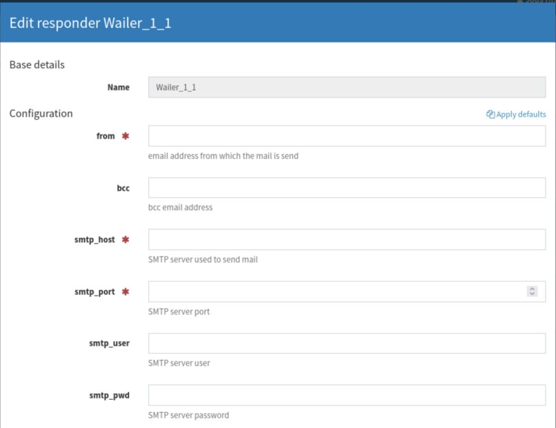
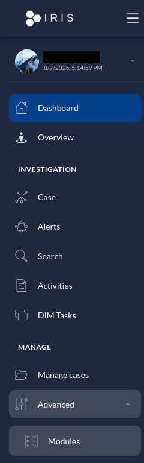
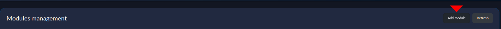
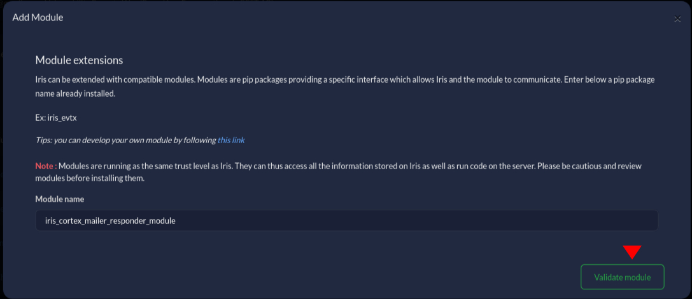
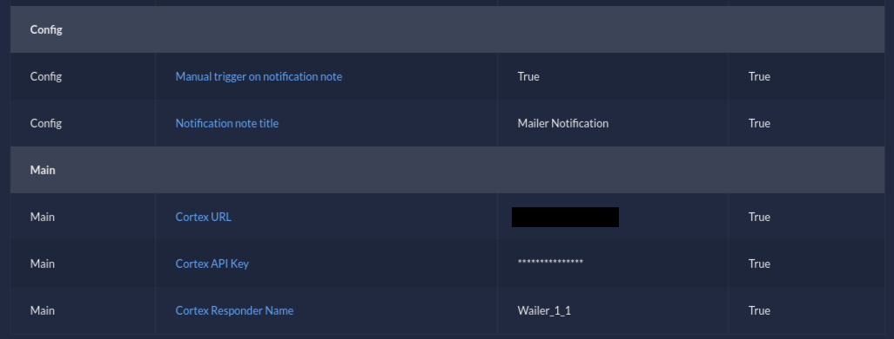
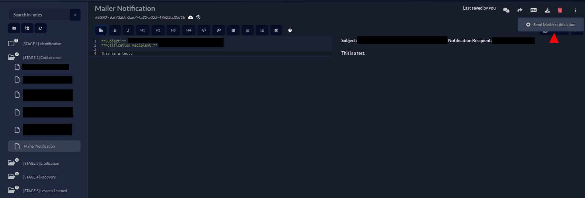
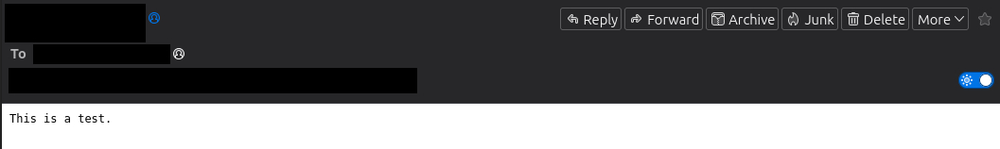

# DFIR-IRIS Cortex Mailer Responder Module 

[](./LICENSE)

`iris_cortex_mailer_responder_module` is an IRIS pipeline/processor module created with [dfir-iris/iris-skeleton-module](https://github.com/dfir-iris/iris-skeleton-module). This version of the module is a based on [socfortress/iris-cortexanalyzer-module](https://github.com/socfortress/iris-cortexanalyzer-module), modified to execute Cortex Mailer Responder.

<br/>
<div align="center">
  
  <h3 align="center">DFIR-IRIS Cortex Mailer Responder Module</h3>
</div>

## Intro

Use the `Cortex Mailer Responder` module to run a modified Cortex Mailer Responder via the DFIR-IRIS platform.

The module was tested with:

| [DFIR-IRIS](https://github.com/dfir-iris/iris-web?tab=readme-ov-file) | [Cortex](https://hub.docker.com/r/thehiveproject/cortex/) |
| --------------------------------------------------------------------- | --------------------------------------------------------- |
| v2.4.22                                                               | 3.2.1-1                                                   |
| v2.4.27                                                               | 4.0.1-1, 4.1.0-1                                          |

The module requires a working Cortex instance configured with an organization, a user with the read/analyze roles, and the user's API Key.

## Wailer

Wailer is a Cortex Responder based on the [Cortex Mailer Responder](https://thehive-project.github.io/Cortex-Analyzers/responders/Mailer/), a module used to send an email with information from a TheHive case or alert.  

This version of the responder was modified to be compatible with DFIR-IRIS, giving it the capability to send a note content as an email. Additionally, it was given the ability to define the BCC email header in order to keep a record of the emails sent by the responder. It was also modified to be capable of sending an email to multiple recipients.

The below steps assume you already have your own [Cortex](https://github.com/thehive-project/Cortex) application up and running.

To install the responder, copy the [Wailer](./Wailer/) directory to the Cortex root directory.

Create or modify the Cortex Dockerfile to include python, python3-pip and python3-venv packages. Copy the Wailer folder into the image as `Mailer` and install the libraries defined in the requirements.txt file.

Below is an example of the Dockerfile.

```Dockerfile
FROM thehiveproject/cortex:4.1.0-1

RUN rm /etc/apt/sources.list.d/corretto.list && \
    apt update && \
    apt-get install -y python3 python3-pip python3-venv

RUN mkdir -p /cortex/application

COPY ./Wailer /vol/cortex/application/Mailer

RUN chown -R nobody:nogroup /vol

RUN python3 -m venv /opt/venv

RUN /bin/bash -c "source /opt/venv/bin/activate && pip3 install -r /vol/cortex/application/Mailer/requirements.txt"

ENTRYPOINT ["/bin/bash", "-c", "source /opt/venv/bin/activate && exec /opt/cortex/entrypoint"]
```

Next, build the image. Then modify the `application.conf` file to include in the responders section the path to the `Mailer.json` file. Also make sure that Cortex can execute jobs locally (process).  

```conf
# RESPONDERS
## SECRET KEY
#
# The secret key is used to secure cryptographic functions.
#
# IMPORTANT: If you deploy your application to several  instances,  make
# sure to use the same key.
play.http.secret.key="..."

play.http.context="/"

## ElasticSearch
search {
  index = cortex
  uri = "http://elasticsearch:9200"
}

## Cache
cache.job = 10 minutes

job {
  runner = [docker, process]
}

## ANALYZERS
analyzer {
  urls = [
    "https://download.thehive-project.org/analyzers.json"
  ]
}

# RESPONDERS
responder {
  urls = [
    "https://download.thehive-project.org/responders.json",
    "/vol/cortex/application/Mailer/Mailer.json"
  ]
}
```

Start the container and access Cortex with an `orgadmin` acount. Navigate to `Organization -> Responders`, and search for `Wailer_1_1`.

Click on `Enable` and configure the mandatory variable.

<div align="center" width="100" height="50">
  <h3 align="center">Wailer_1_1 Configuration</h3>
  <p align="center">
    <br/>
    
    <br/>
    <br/>
  </p>
</div>

Next, click on the `save` button.

## Module Installation

The below steps assume you already have your own DFIR-IRIS application up and running.

Fetch the `Cortex Analyzer Module` Repo.

```bash
git clone https://github.com/cybersec-ipb-pt/iris-cortex-mailer-responder-module
cd iris-cortex-mailer-responder-module
```

The required binary file can be built from scratch using the following commands:

```bash
python3 setup.py bdist_wheel

mv dist/iris_cortex_mailer_responder_module-1.0-py3-none-any.whl /path/to/iris-web/source/dependencies

rm -r build dist iris_cortex_mailer_responder_module.egg-info
```

Or use the pre-compiled [binary](./iris_cortex_mailer_responder_module-1.0-py3-none-any.whl):

```bash
cp iris_cortex_mailer_responder_module-1.0-py3-none-any.whl /path/to/iris-web/source/dependencies
```

Inside the `iris-web` directory, edit the `docker/webApp/Dockerfile`.

Locate the following line: 

```Dockerfile
RUN chmod +x iris-entrypoint.sh
```

On top of it add the following:

```Dockerfile
RUN pip3 install /iriswebapp/dependencies/iris_cortex_mailer_responder_module-1.0-py3-none-any.whl
```

Next, execute the following commands to build and start the containers.

```bash
docker compose build
docker compose up -d
```

## Module Configuration

Once installed, configure the module to include:

+ Cortex API Endpoint (e.g., `http(s)://localhost:9001`)
+ Cortex API Key
+ Notification note title (e.g., `Mailer Notification`)

The `Notification note title` field defines the notes on which the module can be executed. If the note title does not match the value defined in this field, the module will not send the notification.

To define multiple note titles, use `|` to separate them.

1. Navigate to `Advanced -> Modules`.

<div align="center" width="100" height="50">
  <h3 align="center">Advanced -> Modules</h3>
  <p align="center">
    <br/>
    
    <br/>
    <br/>
  </p>
</div>

2. Add a new module.

<div align="center" width="100" height="50">
  <h3 align="center">Add a new module</h3>
  <p align="center">
    <br/>
    
    <br/>
    <br/>
  </p>
</div>

3. Input the module name: `iris_cortex_mailer_responder_module`, and click on the `Validate module` button.

<div align="center" width="100" height="50">
  <h3 align="center">Input Module</h3>
  <p align="center">
    <br/>
    
    <br/>
    <br/>
  </p>
</div>

4. Configure the module, and click on the `Enable module` button.

<div align="center" width="100" height="50">
  <h3 align="center">Configure Module</h3>
  <p align="center">
    <br/>
    
    <br/>
    <br/>
  </p>
</div>

## Running the Module

To run the module select `Case -> Notes`. Create a note with a title that was defined in the `Notification note title` field.

In the Note, make sure to include the following two variables.

```
**Subject:** Email subject
**Notification Recipient:** Email recipient
```

The responder will intake these two variables and use them as the email subject and the recipient for the email notification. 

To send a notification to multiple recipients, make sure to separate them with a comma (e.g., email1@email.com, email2@email.com).

Then, on the top right corner of the note, click on the `...`, followed by `Send Mailer notification`.

<div align="center" width="100" height="50">
  <h3 align="center">Run Module</h3>
  <p align="center">
    <br/>
    
    <br/>
    <br/>
  </p>
</div>

<div align="center" width="100" height="100">
  <h3 align="center">Result</h3>
    <p align="center">
    <br/>
    
    <br/>
    <br/>
  </p>
</div>